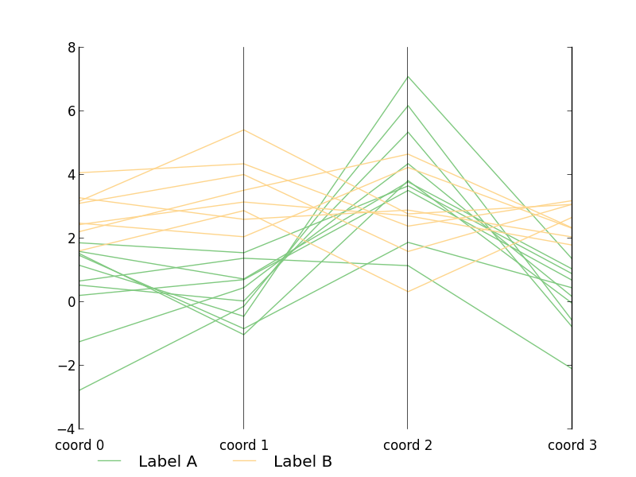
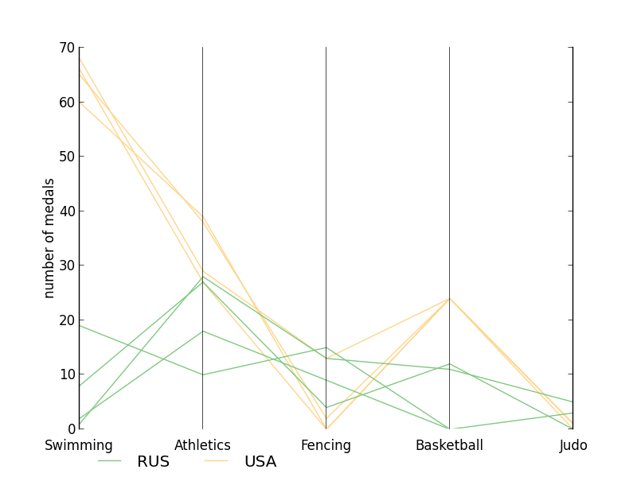
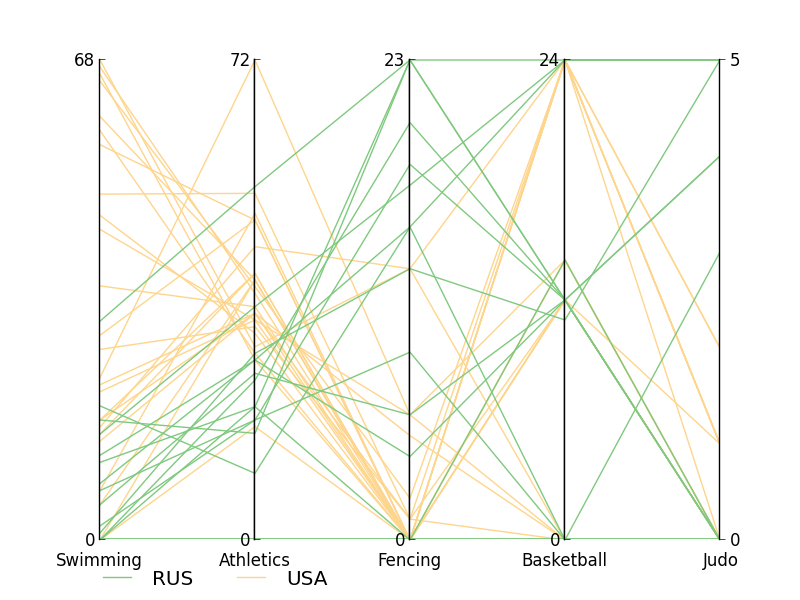

:Author: Bartosz Telenczuk
:Date: September, 2013
:Revision: 2

.. role:: raw-latex(raw)
   :format: html

.. raw:: html

   

.. |--| unicode:: U+2013  

.. note::

   In all of the code examples are given in python 2.7 syntax. In addition,
   standard python imports are used::

       import numpy as np
       import matplotlib.pyplot as plt

Visualization Exercises
=======================

**List of exercises**:

  * `Basic matplotlib`_ |--| first steps in matplotlib
  * `Exploring Olympic Games`_ |--| for more advanced matplotlib users

Basic matplotlib
----------------

This tutorial covers the  basic ``pyplot`` interface of ``matplotlib``.
You will use the  interface to produce quickly efficient visualizations 
of your data. You may skip the section if you used matplotlib before.

1. Generate two data arrays of equal lengths (X and Y variable).
   This could look like this::
     
     import numpy as np
     t = np.arange(0.1, 9.2, 0.15)
     #add some noise to dependent variable
     y = t+np.random.rand(len(t)) 

2. Import ``matplotlib.pyplot`` and plot the data as an XY graph::

     import matplotlib.pyplot as plt
     plt.plot(t,y)
     plt.show()

3. Last plot appeared only after ``plt.show()`` command. To switch to
   interactive mode, in which you can see immediately the output of
   your commands use ``plt.ion()``. Try calling the ``plt.plot``
   function again. 

4. Label the axes by calling ``plt.xlabel`` and ``plt.ylabel``
   functions.

5. You can select line and point style passing a third format argument to
   ``plt.plot`` function. For example, to plot only points::

    plt.plot(t,y,'.')

6. Find out from the ``plt.plot`` docstring about other formats.
   Plot the data with red stars and dashed line.

7. Export the plot to a PDF, PNG or SVG file using the ``plt.savefig`` 
   function.

Exploring Olympic Games
-----------------------

File ``olympics_merged.csv`` contains medal tables of the Summer
Olympics from years 1896-2008 for each medal-winning athlete. Your
goal is
to compare how different countries performed in various disciplines.

You do not have to finish all exercises - please work at your own pace.
However, if you are stuck, please ask tutors for help or check the
solution at the school's website.

The template for all solutions is in ``olympics_vis.py`` file. Please
complete the function definitions in this file with your solutions.

1. **Implementing parallel coordinates**

   Parallel coordinates is a very useful technique that
   helps to visualise multidimensional data (both quantitative and
   categorical). The basic idea is to represent distinct dimensions 
   on axes plotted in parallel (horizontal or vertical) and grouping
   coordinates belonging to a single data point (observation) by
   connecting them with straight lines.

   Read more in Wikipedia_.

   Your goal is to implement a generic ``parallel_coordinates``
   function to plot suitably-formatted data in parallel coordinate
   format. In addition, the function will take category names so that
   different observations can be visually grouped using colour coding.

   To finish exercise you have to implement ``parallel_coordinates``
   in ``olympics_vis.py`` according to a function signature given in
   the function's doc-string. Please remember to:

      * Use a single sub-plot and add grid lines at positions
        of different coordinates.

      * Produce ''clean'', clutter-free plot by removing spurious
        lines and configuring the axes appropriately.

      * Use ''qualitative'' color map such as Accent_ from
        Colorbrewer to represent data categories.

      * Add labels of the coordinates and legend for the categories.

   To test your solution run the ``ex1_parallel_coordinates.py``
   example. This script should generate a plot similar to:
    
   *Hint*: To inspect the data inside the function 
   interactively you may use the ``import
   pdb; pdb.set_trace()`` idiom or IPython's  magic keyword ``%debug`` as
   introduced in Debugging lecture.

2.  **Plotting medal standings**
    
    Your goal is to use ``parallel_coordinates`` function implemented
    in previous exercise to represent how different countries performed
    in various disciplines. Here, the disciplines are the coordinates
    and the number of medals won by different countries across years
    are the values.

    You are provided with dataset that contains detailed information
    (name, represented country, Olympics edition, discipline etc.)
    about each medal-winning athlete.

    You have to count total number of medals in selected disciplines, years and
    countries and store the data in format accepted by the
    ``parallel_coordinates`` function. To this end, implement
    ``format_data`` function in ``olympics_vis.py``. Specific
    instructions are given in the function's doc-string.

    *Note*: Medal counts of different countries are intermixed in the
    same table. ``country_names`` are used to discriminate between
    countries as it was done with categories in previous exercise.

    Basic example for running your solution is provided in
    ``ex2_summer_olympics.py``, which  imports  the data, converts it
    using your ``format_data`` function and
    calls ``parallel_coordinates`` to produce the plot.

    The result should look similar to:

 
Congratulations, you have just learnt the basics of matplotlib and you
are ready to create your own data visualizations. I hope you enjoyed
the exercise.

3.  **Nomalising coordinates**

    One of the problems in the visualisation from the previous
    exercise is that each discipline has different number of
    competitions, so that the scales for the coordinates are
    different.

    Your goal is to implement a variant of parallel coordinate plot in
    which variables are normalised. To do that, please complete the
    implementation in ``normalised_coordinates`` function in
    ``olympics_vis.py``. Please take care to set the ticks on the
    axes to correct data ranges (non-normalised).

    *Hint*: One approach is to use separate sub-plots that are stacked
    together. However, please feel free to experiment with your ideas!

    You can test your solutions with ``ex3_normalised_coordinates.py``
    example. If you run it, you should get something similar to:

**Data Sources**:

`The Guardian <http://www.theguardian.com/commentisfree/2012/aug/03/london-2012-olympics-open-data>`_

.. _Wikipedia: http://en.wikipedia.org/wiki/Parallel_coordinates
.. _Accent: http://colorbrewer2.org/index.php?type=qualitative&scheme=Accent&n=6

